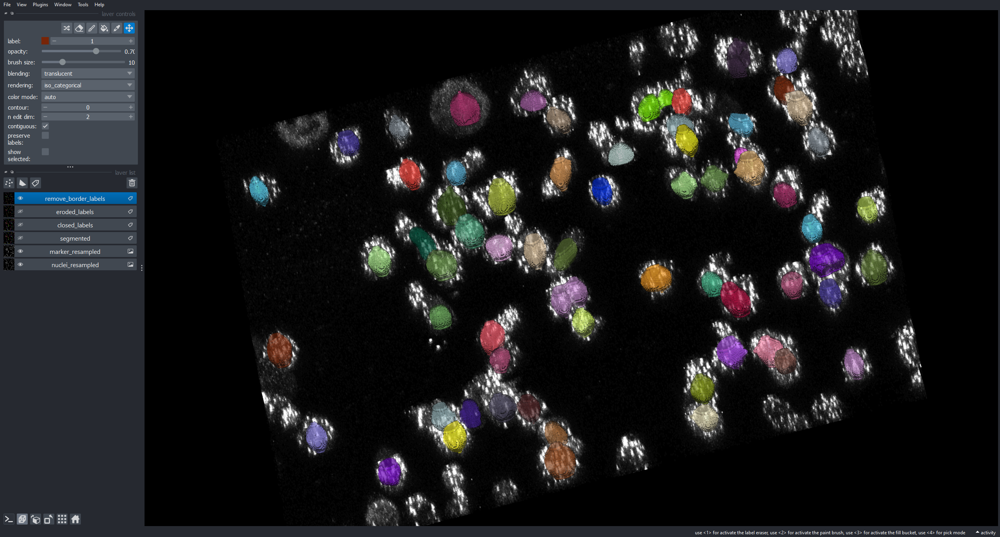

# Analyze nuclear translocation of proteins in 3D confocal imaging

Checking nuclear translocation of proteins using Voronoi-Otsu labeling and label erosion from pyclesperanto

<h2>Instructions</h2>

1. In order to run these Jupyter notebooks and .py scripts you will need to familiarize yourself with the use of Python virtual environments using Mamba. See instructions [here](https://biapol.github.io/blog/mara_lampert/getting_started_with_mambaforge_and_python/readme.html).

2. Then you will need to create a virtual environment either using the following command:

   <code>mamba create -n nuclear_translocation python=3.9 devbio-napari boto3 plotly pyqt -c conda-forge</code>

3. Run the <code>0_data_download.ipynb</code> notebook to fetch the raw_data from an AWS S3 bucket. [Contact Me](mailto:alberto.d.sanchez@ntnu.no) to obtain a fresh working link.

4. The next 3 notebooks allow you to analyze all images, explore the results and visualize in detail the segmentation using Napari.

